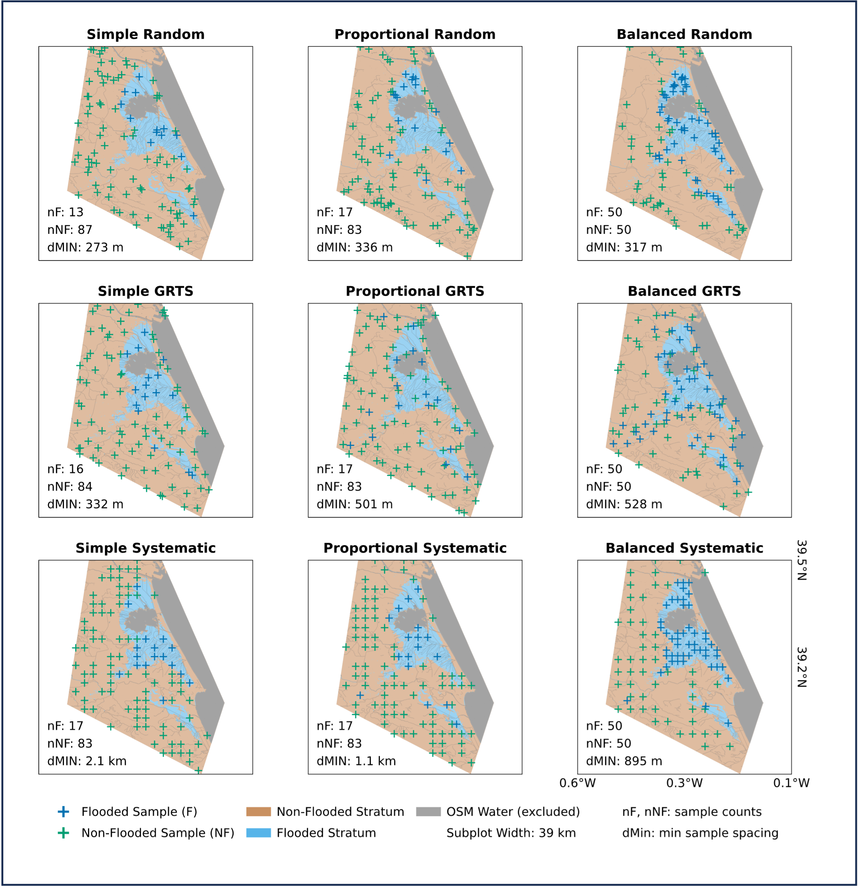

# saRFlood – Sampling

This repository contains functionalities for the 2. part of the saRFlood pipeline - Sampling from the input_image.
Following Sampling Strategies can be used:

- Simple Random Sampling
- Stratified Sampling
- Generalized Random Tessellation Stratified (GRTS) Sampling
- Systematic Square Grid Sampling

To compare different class and spatial distributions in the sample selection, the following sample sets can be created and plotted.

## Sample Sets 

Data Source: (c) OpenStreetMap contributors and (c) European Union, Copernicus Emergency

## Usage
pipeline.py outlines the complete sampling and visualization process. 

## References

### Packages
- PyGRTS ([GitHub](https://github.com/jsta/pygrts)) - Copyright (c) 2020-- pygrts

### Publications
Stevens Jr, D. L., & Olsen, A. R. (2004). Spatially balanced sampling of natural resources. *Journal of the American Statistical Association*, 99(465), 262-278. https://doi.org/10.1198/016214504000000250
